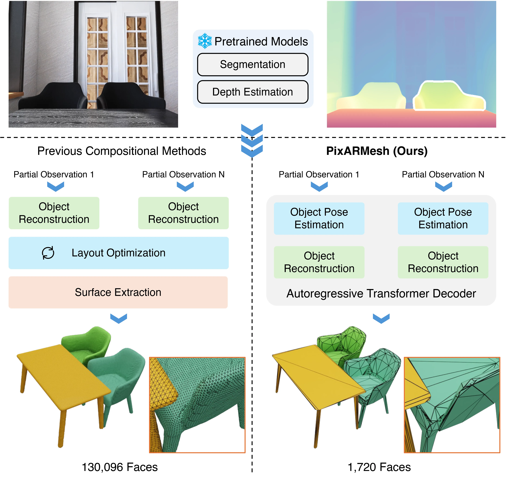

<p align="center">
  <h1 align="center">
    <a href="https://mlpc-ucsd.github.io/PixARMesh/">PixARMesh</a>: 
    Autoregressive Mesh-Native Single-View Scene Reconstruction
  </h1>

  <p align="center">
    <a href="https://xzhang.dev/" target="_blank"><strong>Xiang Zhang</strong></a><sup>*,1,2,&dagger;</sup> ·
    <a href="https://www.linkedin.com/in/sohyun-yoo/" target="_blank"><strong>Sohyun Yoo</strong></a><sup>*,1</sup> ·
    <a href="https://onehfr.github.io/" target="_blank"><strong>Hongrui Wu</strong></a><sup>*,1,&Dagger;</sup> ·
    <a href="https://github.com/chuanli11" target="_blank"><strong>Chuan Li</strong></a><sup>2</sup> ·
    <a href="http://www.stat.ucla.edu/~jxie/" target="_blank"><strong>Jianwen Xie</strong></a><sup>2</sup> ·
    <a href="https://pages.ucsd.edu/~ztu/" target="_blank"><strong>Zhuowen Tu</strong></a><sup>1</sup>
  </p>

  <p align="center">
    <sup>1</sup><strong>UC San Diego</strong> ·
    <sup>2</sup><strong>Lambda, Inc.</strong>
  </p>

  <p align="center">
    <strong><i style="color:red;">CVPR 2026</i></strong>
  </p>

  <p align="center" style="font-size:80%;">
    <sup>*</sup> Equal contribution
  </p>

  <p align="center" style="font-size:70%;">
    <sup>&dagger;</sup> Work partially done during internship at Lambda.
  </p>

  <p align="center" style="font-size:70%;">
    <sup>&Dagger;</sup> H. Wu contributed during internship at UC San Diego.
  </p>
</p>

<h3 align="center">
  <a href="https://mlpc-ucsd.github.io/PixARMesh/"><strong>Project Page</strong></a> |
  <a href="https://arxiv.org/pdf/2603.05888"><strong>Paper</strong></a> |
  <a href="https://arxiv.org/abs/2603.05888"><strong>arXiv</strong></a>
</h3>

<div align="center">
  
</div>

---

**PixARMesh** is a mesh-native autoregressive framework for **single-view 3D scene reconstruction**.  
Instead of reconstructing via intermediate volumetric or implicit representations, PixARMesh directly models instances with native mesh representation. Object poses and meshes are predicted in a unified autoregressive sequence.

This repository contains the official implementation for **PixARMesh (CVPR 2026)**.

---

## 🛠️ Environment Setup

We recommend using our **pre-built Docker image**:

```bash
docker pull zx1239856/trl-runner:0.2.0
```

Alternatively, you can build the environment manually using the provided [Dockerfile](Dockerfile).

Key requirements:

- Install dependencies from:

```
requirements.txt
requirements-no-iso.txt
```

- Install the [EdgeRunner tokenizer](https://github.com/NVlabs/EdgeRunner/tree/main/meto).
- PyTorch ≥ 2.10 recommended.

## 🗂️ Dataset Preparation

Download the packed dataset from HuggingFace:

https://huggingface.co/datasets/zx1239856/3d-front-ar-packed

### Training Only

Flatten the dataset to ensure uniform instance sampling across scenes:

```bash
python -m scripts.flatten_dataset
```

This will generate:

```
datasets/3d-front-ar-packed-flattened
```

Flattening prevents instances from scenes with many objects from being under-sampled during training.

### Inference / Evaluation Only

Download the following items and unzip them inside the `datasets/` directory:

- [3D-FUTURE-model-ply](https://huggingface.co/datasets/zx1239856/PixARMesh-eval-data/resolve/main/3D-FUTURE-model-ply.zip)
  Ground-truth object meshes (undecimated)

- [ar-eval-gt-undecimated](https://huggingface.co/datasets/zx1239856/PixARMesh-eval-data/resolve/main/ar-eval-gt-undecimated.zip)
  Ground-truth scene meshes (undecimated)

- [depth_pro_aligned_npy](https://huggingface.co/datasets/zx1239856/PixARMesh-eval-data/resolve/main/depth_pro_aligned_npy.zip)
  Aligned **Depth Pro** predictions used for inference

- [grounded_sam](https://huggingface.co/datasets/zx1239856/DepR-3D-FRONT/resolve/main/grounded_sam.zip)
  Segmentation masks generated with **Grounded-SAM**

## 🧠 Training

`launch.py` is a wrapper around `accelerate launch` that automatically configures the environment.

PixARMesh uses **two-stage training**:

1. Layout prediction
2. Full autoregressive sequence training

### Stage 1 - Layout Prediction

```bash
python launch.py train.py --config-name=edgerunner_3d_front_global_obj_pose_w_img_ctx_layout_only
```

### Stage 2 - Full Training

Replace `model.local_path` with the checkpoint path from Stage 1.

```bash
python launch.py train.py --config-name=edgerunner_3d_front_global_obj_pose_w_img_ctx model.local_path=outputs/edgerunner-3d-front-global-obj-pose-w-img-ctx-layout-only/1/checkpoints/final
```

## 📊 Evaluation

Distributed inference is supported via **Accelerate**.

You may either:

- Use the pretrained model from HuggingFace
- Provide a path to a local checkpoint

### Object-Level

1. Inference

```bash
accelerate launch --module scripts.infer --model-type edgerunner --run-type obj --checkpoint zx1239856/PixARMesh-EdgeRunner --output outputs/inference
```

2. Evaluation

```bash
accelerate launch --module scripts.eval_obj --pred-dir outputs/inference/obj/edgerunner/gt_layout_gt_mask_pred_depth --save-dir outputs/evaluations-obj/edgerunner
```

### Scene-Level

1. Inference

```bash
accelerate launch --module scripts.infer --model-type edgerunner --run-type scene --checkpoint zx1239856/PixARMesh-EdgeRunner --output outputs/inference
```

2. Compose Scene Meshes

```bash
python -m scripts.compose_scene --pred-dir outputs/inference/scene/edgerunner/pred_layout_pred_mask_pred_depth
```

3. Evaluation

```bash
accelerate launch --module scripts.eval_scene --pred-dir outputs/inference/scene/edgerunner/pred_layout_pred_mask_pred_depth/scenes --save-dir outputs/evaluation-scene/edgerunner
```

## 🏷️ License

This repository is released under the [CC-BY-SA 4.0 License](LICENSE).

## 🙏 Acknowledgements

PixARMesh builds upon several excellent open-source projects:

- [Grounded-Segment-Anything](https://github.com/IDEA-Research/Grounded-Segment-Anything)
- [Depth Pro](https://github.com/apple/ml-depth-pro)
- [DINOv2](https://github.com/facebookresearch/dinov2)

Core libraries and frameworks:

- [HuggingFace Transformers](https://github.com/huggingface/transformers)
- [DepR](https://github.com/mlpc-ucsd/DepR) - evaluation pipeline
- [EdgeRunner](https://github.com/NVlabs/EdgeRunner) - pre-trained weights
- [BPT](https://github.com/Tencent-Hunyuan/bpt) - pre-trained weights

We also use physically-based renderings from the [3D-FRONT](https://tianchi.aliyun.com/specials/promotion/alibaba-3d-scene-dataset) scenes provided by [InstPIFu](https://github.com/GAP-LAB-CUHK-SZ/InstPIFu), along with additional processed assets from [DepR](https://github.com/mlpc-ucsd/DepR).

## 📝 Citation

If you find PixARMesh useful in your research, please consider citing:

```bibtex
@article{zhang2026pixarmesh,
  title={PixARMesh: Autoregressive Mesh-Native Single-View Scene Reconstruction},
  author={Zhang, Xiang and Yoo, Sohyun and Wu, Hongrui and Li, Chuan and Xie, Jianwen and Tu, Zhuowen},
  journal={arXiv preprint arXiv:2603.05888},
  year={2026}
}
```
